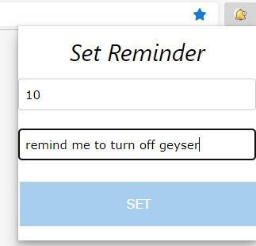

# Reminder Chrome Extension

This is a simple extension which allows you to set a single (short term) reminder for the specified number of minutes.  

To load this extension, download this repository and exact it to any folder and follow the below steps:

- Open the Extension Management page by navigating to chrome://extensions.
- The Extension Management page can also be opened by clicking on the Chrome menu, hovering over More Tools then selecting Extensions.
- Enable Developer Mode by clicking the toggle switch next to Developer mode.
- Click the LOAD UNPACKED button and select the extension directory.

.

:exclamation: For Edge users, if you do not see the notifications, please try this:  

> Open Chrome > Go chrome://flags > Search Enable native notifications > Change it to Disabled > Relaunch Chrome

[StackOverflow](https://stackoverflow.com/a/62501750)
